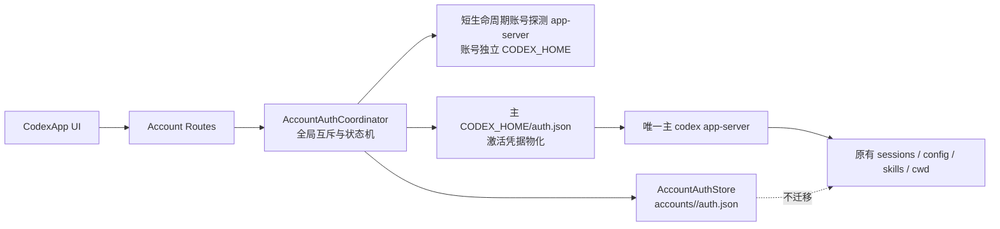

# CodexApp 多账号额度切换开发方案

## 文档信息

| 项目 | 内容 |
| --- | --- |
| 项目/服务 | CodexApp |
| 文档目的 | 研究第三方 Codex 账号切换方案，并设计不迁移本地工作区的多账号切换实现 |
| 适用环境 | `/home/Code/codexapp`，CodexApp `0.1.87`，Codex CLI/app-server `0.147.0` |
| 创建日期 | 2026-09-04 |
| 最后更新 | 2026-09-04 |
| 当前状态 | 草稿，待审阅后实施 |
| 维护者 | CodexApp 维护者 |

## 结论先行

建议采用：**单一主 app-server + 多个独立账号凭据配置档 + 共享且不迁移的主 `CODEX_HOME` 工作区**。

这意味着：

- CodexApp 仍只有一个负责真实对话的主 `codex app-server`。
- 每个账号只保存自己的认证材料，并用短生命周期、账号隔离的 app-server 做登录、刷新和额度探测。
- 切换时只替换主 `CODEX_HOME/auth.json` 的“激活副本”，随后安全重启主 app-server。
- `sessions/`、`archived_sessions/`、`history.jsonl`、`config.toml`、skills、memories、项目列表、当前路由、线程 ID 和线程 `cwd` 均留在原处，不复制、不软链接、不迁移。
- 第一版只做**人工、全局、空闲边界切换**；不做自动用尽切换、不做每个线程单独选账号、不同时运行多个真实对话 worker。

“只影响额度从哪里走”需要精确定义：本地状态层面可以做到只替换认证材料；但 ChatGPT 套餐额度与 OAuth 登录身份绑定，OpenAI 没有公开独立的“billing account selector”。因此切换后，后续远端请求不仅使用目标账号额度，也必然使用目标账号的远端权限、组织/工作区和账号级能力。本方案保证的是**不改变 CodexApp 本地工作区和会话载体**，而不是把额度与远端身份从协议上拆开。

## 目标与范围

### 目标

- 已登录的多个 ChatGPT/Codex 账号可以反复切换，正常的刷新令牌轮换不会让旧账号快照失效。
- 新增账号时不注销、不吊销当前激活账号。
- 切换只影响切换完成之后发起的新请求；已经在执行的请求不切换、不重放。
- 当前项目、文件系统工作目录、会话列表、选中的对话、历史消息和本机配置保持不变。
- 对失效、被吊销、欠费、网络异常等状态给出可执行且不误导的 UI 状态。
- 切换失败时恢复原账号，并恢复原线程的可读/可继续状态。

### 范围

- 包含：ChatGPT OAuth 账号的添加、重新登录、认证刷新、额度探测、手动切换、状态展示、失败回滚。
- 包含：现有 `accounts.json` 和 `accounts/<storageId>/auth.json` 的兼容迁移。
- 不包含：API Key 账单账户路由、自动额度耗尽切换、多账号并发执行、按线程固定不同账号、跨账号迁移 OpenAI 云端任务。
- 不包含：移动、复制或软链接 Codex 主工作区中的任何会话或项目数据。

## 官方认证行为与当前故障根因

### 官方边界

[OpenAI Codex Authentication](https://developers.openai.com/codex/auth/) 说明：CLI 与 IDE 扩展共享缓存登录；凭据通常保存在 `CODEX_HOME/auth.json` 或系统 keyring；ChatGPT 登录令牌会自动刷新。官方文档没有提供同时激活多个 ChatGPT 账号或单独选择额度来源的协议。

更关键的是，本机安装的 `codex-cli 0.147.0` 对应源码提交 `3ed6f04f6bf8b7c46299d1cb1ff99c74ce21a51d`：

- [`login.rs` 的 ChatGPT 登录流程](https://github.com/openai/codex/blob/3ed6f04f6bf8b7c46299d1cb1ff99c74ce21a51d/codex-rs/cli/src/login.rs#L118-L163) 会在启动新登录前调用 `clear_existing_auth_before_login()`。
- 该函数会执行 `logout_with_revoke()`；[`revoke.rs`](https://github.com/openai/codex/blob/3ed6f04f6bf8b7c46299d1cb1ff99c74ce21a51d/codex-rs/login/src/auth/revoke.rs#L1-L76) 优先吊销 refresh token，没有 refresh token 时才使用 access token。
- [`storage.rs`](https://github.com/openai/codex/blob/3ed6f04f6bf8b7c46299d1cb1ff99c74ce21a51d/codex-rs/login/src/auth/storage.rs#L150-L223) 显示文件型认证以 `CODEX_HOME/auth.json` 为边界保存。

因此，在同一个主 `CODEX_HOME` 中依次执行两次 `codex login`，不是“覆盖本地文件这么简单”：第二次登录会先尝试吊销第一个账号当前令牌。事先复制出来的第一个 `auth.json` 虽然文件完整，服务端令牌仍可能已经变成 `token_revoked`。这与本机观察到的“新账号可用，切回旧账号提示登录过期”完全一致。

### CodexApp `0.1.87` 的现有缺口

| 位置 | 当前行为 | 影响 |
| --- | --- | --- |
| `src/server/accountRoutes.ts:1025-1033` | 直接用主进程环境执行 `codex login` | 新登录与当前账号使用同一个 `CODEX_HOME`，会注销/吊销当前账号 |
| `src/server/accountRoutes.ts:645-785` | 把账号快照复制到临时 home，启动额度探测 app-server，结束后删除临时目录 | 即使刷新出新 token，也没有稳定的账号配置档可落盘 |
| `src/server/accountRoutes.ts:672-701` | 临时 JSON-RPC 客户端只处理自己发出的响应，忽略 app-server 主动请求 | 无法正确处理 `account/chatgptAuthTokens/refresh` |
| `src/server/codexAppServerBridge.ts:4616-4684` | 刷新逻辑固定读写主 `auth.json` | 激活账号快照不会随 refresh-token rotation 同步，后续切回可能使用旧 token |
| `src/server/accountRoutes.ts:1313-1403` | 切换前覆盖主 `auth.json`，重启 app-server 后再验证；失败时回写旧内容 | 已有基本回滚，但写入不是完整事务，且目标预检发生得太晚 |
| `src/server/accountRoutes.ts:1315-1321` | 后端只阻止 pending server requests | 没有覆盖其他线程、队列发送、正在执行/中断的 turn |
| `src/App.vue:1803-1809` | 前端只根据当前选中线程和本地发送状态阻止切换 | 多浏览器、后台队列或非选中线程仍可能被切换打断 |
| `src/App.vue:2622-2649` | 切换后保持路由并整体刷新 | 已具备工作区连续性的 UI 基础，但缺少后端线程恢复验收 |

## 同类工具研究

研究时间为 2026-09-04。下表使用固定提交作为行为依据；项目热度只用于理解成熟度，不作为架构正确性的证据。

| 工具 | 核心思路 | 可借鉴点 | 不直接采用的原因 |
| --- | --- | --- | --- |
| [Lampese/codex-switcher](https://github.com/Lampese/codex-switcher/tree/3323f3d5f4b496997e9db135d9ae63011737a226) | 保存多个 `auth.json`，切换前把当前 live auth 同步回账号库，再刷新目标 token 并覆盖主 auth | [`account.rs`](https://github.com/Lampese/codex-switcher/blob/3323f3d5f4b496997e9db135d9ae63011737a226/src-tauri/src/commands/account.rs) 中的串行切换、先同步再切换；[`token_refresh.rs`](https://github.com/Lampese/codex-switcher/blob/3323f3d5f4b496997e9db135d9ae63011737a226/src-tauri/src/auth/token_refresh.rs) 中先持久化轮换后的 refresh token；切换前要求 Codex 停止 | 本质仍是凭据物化；仓库未检测到许可证，不能复制其代码；它面向桌面切换器，不负责 CodexApp 内部队列和线程一致性 |
| [Sls0n/codex-account-switcher](https://github.com/Sls0n/codex-account-switcher/tree/fad1a4199d448ed9dee7661eab3769aabb15235f) | Unix 把主 `auth.json` 软链接到账号快照，Windows 复制文件 | 实现极小；Unix 下普通覆写可直接更新账号快照 | logout 会删除目标/链接，且依赖上游文件操作语义；缺少刷新互斥、健康检查和回滚，不适合作为服务端核心机制 |
| [dejavukong/codex-multi-account](https://github.com/dejavukong/codex-multi-account/tree/18694a0e9c9ecb8b62e2d14e4f88e4e17c416faf) | 每个账号一个完整 `CODEX_HOME`，启动 CLI/VS Code 时注入环境变量；可共享 `config.toml` | 认证隔离清晰，可并行运行多个账号 | 会把 sessions/history/logs 分开，直接违背“工作区不变”的主要目标 |
| [codex-multi-account-shared-history](https://github.com/MrKGhasemi/codex-multi-account-shared-history/tree/1b8c43c1fded369aa8836d8693dbea54bf123dc7) | 每账号独立 home，再把 `sessions/`、`archived_sessions/`、`history.jsonl` 链接到共享目录 | 说明“认证隔离 + 历史共享”在文件层可实现 | 会重接工作区文件结构，存在并发写同一会话风险，需要迁移与复杂回滚；对 CodexApp 过于侵入 |
| [lordydord/Codex-Account-Switcher](https://github.com/lordydord/Codex-Account-Switcher/tree/b223b24b05398f51a5194d253df2ba3aff05af81) | 包装外部切换命令，切换后验证目标账号，失败回滚，并重启桌面应用 | “停止/切换/验证/回滚/重启”的事务顺序；额度冷却与可用性状态 | 凭据生命周期委托给外部工具；自动续接和自动切换不适合第一版 |
| [irisxc4/codex-multi-account-router](https://github.com/irisxc4/codex-multi-account-router/tree/93e7a01c47ee973f6604001d2171557e36816b25) | 每账号一个 app-server worker，前置 RPC multiplexer；线程首次路由后粘在账号上 | [线程粘性与显式迁移 ADR](https://github.com/irisxc4/codex-multi-account-router/blob/93e7a01c47ee973f6604001d2171557e36816b25/docs/adr/0002-thread-sticky-and-explicit-migration.md)、[前端账号投影 ADR](https://github.com/irisxc4/codex-multi-account-router/blob/93e7a01c47ee973f6604001d2171557e36816b25/docs/adr/0004-front-account-projection.md) 对未来按线程路由有参考价值 | 多 worker、RPC 路由、线程所有权数据库和故障转移远超当前需求；会把“全局额度切换”升级为新的运行平台 |

### 归纳出的五类实现思路

1. **直接复制凭据**：最普遍、最接近当前 CodexApp，但必须补齐令牌轮换、互斥、验证和回滚。
2. **用软链接让 active auth 指向账号快照**：简单，但会把正确性绑定到上游对文件的 truncate/remove/rename 行为。
3. **每账号完整隔离 `CODEX_HOME`**：认证最干净，却自然分裂会话和配置。
4. **隔离 home 后再链接共享历史**：能恢复共享视图，但对工作区做了本方案刻意避免的物理改造。
5. **多个 app-server + 路由器**：适合并行多账号与自动路由，不适合“轻量、全局切换额度来源”的第一版。

## 推荐架构



### 1. 数据边界

主 `CODEX_HOME` 继续承担所有真实工作区状态：

```text
CODEX_HOME/
├── auth.json                    # 当前账号的激活物化副本
├── accounts.json                # 非敏感账号元数据、状态、revision
├── accounts/
│   └── <storageId>/
│       └── auth.json            # 该账号的权威凭据配置档
├── sessions/                    # 保持原位
├── archived_sessions/           # 保持原位
├── history.jsonl                # 保持原位
├── config.toml                  # 保持原位
├── skills/                      # 保持原位
└── memories/                    # 保持原位
```

约束：

- `accounts/<storageId>/auth.json` 是账号凭据的权威副本；主 `auth.json` 只是当前激活版本的物化。
- 不采用主 `auth.json` 到账号文件的软链接，避免 `codex logout/login` 删除链接目标或上游改用 rename 后语义改变。
- 账号目录 `0700`、认证文件 `0600`；API、日志、遥测和错误对象不得包含 token、授权码或完整 auth JSON。
- `storageId` 继续使用稳定的账户身份组合，不能只用 email；团队 workspace 下同一用户可能有多个 account/workspace identity。
- `accounts.json` 增加 schema version、`credentialRevision`、`authStatus`、`lastVerifiedAtIso` 等元数据，不存 token。

### 2. 账号登录必须隔离

新增/重新登录流程不得在主 `CODEX_HOME` 中执行 `codex login`：

1. 在 `accounts/.pending/<loginSessionId>/` 建立仅本次登录使用的隔离 home。
2. 对子进程设置 `CODEX_HOME` 为该目录，并确保该受管进程使用 file credential store；具体 CLI override 在 P0 用当前安装版本验证。
3. 完成浏览器回调后，从隔离 home 读取并解析 `auth.json`，通过 `account/read` 核验实际身份。
4. 若是重新登录，身份必须与目标 `storageId` 一致；若是新增账号，则计算新的 `storageId`。
5. 原子写入对应账号配置档；失败时保留旧配置档，不触碰主 auth。
6. 默认语义为“添加账号但不切换”；用户另行点击切换。可以提供明确的“登录并切换”，但内部仍先完成添加事务，再调用同一切换事务。
7. 清理 pending home。取消登录只清理 pending home，不执行主账号 logout。

这样即使官方 `codex login` 仍执行“先 logout/revoke”，被清除的也只是隔离 home 中的凭据，不会吊销当前激活账号。

### 3. 账号级额度探测与刷新

用**持久凭据配置档 + 短生命周期 probe 进程**替代“复制到临时目录后无条件删除”：

- probe 的 `CODEX_HOME` 指向账号目录，或指向只把 auth 持久化回该目录的受控 profile；它不承载用户对话。
- 抽取可复用的 JSON-RPC 客户端，既处理响应，也处理 app-server 主动发来的 `account/chatgptAuthTokens/refresh`。
- 刷新方法接收明确的账号/store 参数，不再固定读写主 `auth.json`。
- 每个账号使用 single-flight refresh；全部账号的登录、刷新、切换、删除再由一个全局 coordinator 串行化关键写操作。
- OAuth 返回新 refresh token 时，先把新凭据写入该账号的权威配置档，再回复 app-server；不能在错误分支中丢弃已经轮换的 token。
- 额度刷新使用 TTL，后台探测并发限制为 1（后续有测量证据再调整），避免账号数增长带来无界进程和网络扇出。

### 4. 主账号自动刷新同步

主 app-server 收到 `account/chatgptAuthTokens/refresh` 时：

1. coordinator 锁定当前 `activeStorageId` 和 credential revision。
2. 从该账号权威配置档发起刷新，校验返回的 account identity 未改变。
3. 先提交账号配置档的新 revision，再更新主 `auth.json` 的激活物化。
4. 两处都成功后才向 app-server 返回新 token。
5. 如果账号档已保存、主物化失败，不回滚到已失效的旧 refresh token；标记 `active_materialization_dirty`，阻止新 turn，并在下一次启动前从权威档重新物化。
6. 旧异步操作携带的 revision/operation epoch 不匹配时不得覆盖新凭据。

### 5. 切换是一个事务

账号切换是**服务器全局行为**，不是某个浏览器标签页的局部设置。建议请求包含 `storageId`、`expectedActiveStorageId` 和可选 `resumeThreadId`；不满足乐观并发前提时返回 `409`。

```text
获取 coordinator 锁
  -> 后端确认全局空闲
  -> 同步当前主 auth 到当前账号档（身份匹配且 revision 合法时）
  -> 在目标账号 profile 中刷新/验证 account/read + rateLimits/read
  -> 保存可能轮换的新 token
  -> 原子物化目标 auth 到主 CODEX_HOME
  -> 停止并重新启动主 app-server
  -> 核对 account/read 确为目标账号
  -> 对当前选中线程执行 thread/read / 必要时 thread/resume
  -> 提交 activeStorageId
  -> 释放锁并刷新 UI
```

后端“全局空闲”至少包含：

- 所有线程都没有 active turn，而不只是当前 UI 选中的线程。
- 没有待发送/重试的队列项，没有正在执行的 interrupt/steer。
- 没有待人工处理的 approval、request_user_input 或其他 server request。
- 没有正在进行的登录、刷新、删除或另一切换事务。

失败回滚：

- 目标账号预检失败时不修改主 auth。
- 已物化后验证失败，则原子恢复前一账号权威配置档到主 auth，重启主 app-server，并重新读取/恢复同一个线程。
- 不重发上一条用户消息，不把未完成 turn 迁到另一账号。
- 只有“原账号恢复 + 原线程可读”成功才把响应定义为已回滚；否则返回明确的 degraded 状态并阻止发送，而不是伪装成功。

### 6. 会话与工作区连续性

切换前后始终由同一个主 `CODEX_HOME` 承载会话。主 app-server 重启会丢失内存缓存，但不会移动 rollout 文件。现有 bridge 已有 `thread/resume` 恢复路径，可作为基础，但切换事务需要显式验收：

- UI 路由、selected thread ID、项目 root 和 `cwd` 不变。
- `thread/read` 的消息数、最近一条消息标识和 rollout path 不变。
- 恢复完成前禁用 composer；恢复成功后才显示切换成功。
- 若目标账号下无法恢复当前线程，则回滚账号，不能为了完成切换而创建新线程或复制历史。

这保证的是本地工作区连续性。OpenAI 云端异步任务、团队 workspace、连接器或其他账号级远端资源可能属于原账号；第一版不尝试跨账号迁移这些对象。

### 7. 状态机与 UI

建议状态：

| 状态 | 含义 | UI 行为 |
| --- | --- | --- |
| `ready` | token 和额度探测可用 | 可切换 |
| `refreshing` | 正在刷新 token/额度 | 显示进行中，临时禁用重复操作 |
| `switching` | 全局切换事务进行中 | 全局禁用发送和账号操作 |
| `reauth_required` | refresh token 被吊销、无效或账号身份不一致 | 不再盲目切换，显示“重新登录” |
| `payment_required` | 账号额度/套餐不可用 | 显示原因；默认禁用切换 |
| `stale` | 最近探测过期，但没有确认账号失效 | 允许手动重试探测，不误判为退出登录 |
| `transient_error` | 网络、超时或上游暂时故障 | 保留上次可信额度，允许重试 |
| `materialization_dirty` | 权威账号档已更新，但主 auth 同步失败 | 禁止新 turn，自动修复或提示恢复 |

错误分类不得只看 HTTP 状态：`401 token_revoked` 应直接进入 `reauth_required`；普通 access token 过期应先尝试 refresh；网络超时不能把账号永久标成失效。

切换成功提示建议明确写成：

> 已切换到“账号显示名”。之后新发起的请求将使用该账号额度；当前项目、工作目录和对话未改变。

第一版不提供“额度耗尽后自动切换”。自动切换会在用户不知情时改变远端账号身份，而且与进行中的 turn、审批和工具调用存在竞态；待手动切换稳定并有完整遥测后再单独设计。

## 代码改造范围

| 文件/模块 | 计划变更 |
| --- | --- |
| 新建 `src/server/accountAuthStore.ts` | 认证解析、身份提取、权限检查、账号档原子写入、revision 和激活物化 |
| 新建 `src/server/accountAuthCoordinator.ts` | 全局互斥、single-flight、状态机、登录/刷新/切换/回滚事务 |
| 新建 `src/server/accountAppServerProbe.ts` | 账号隔离的短生命周期 app-server 与完整双向 JSON-RPC 处理 |
| `src/server/accountRoutes.ts` | 收敛为 HTTP 参数校验和 coordinator 调用；登录改用 pending home；返回结构化状态 |
| `src/server/codexAppServerBridge.ts` | auth refresh 接入显式 account store；暴露后端全局空闲快照；支持切换后的线程恢复验证 |
| 队列/turn 状态相关服务 | 提供权威 `RuntimeQuiescenceSnapshot`，覆盖后台和非选中线程 |
| `src/api/codexGateway.ts` | 新请求/响应类型、乐观并发参数、re-auth 和结构化错误 |
| `src/types/codex.ts` | 账号状态、action required、credential revision 等公共类型 |
| `src/App.vue` | “添加不切换”、重新登录、状态徽标、全局切换锁和连续性提示 |
| `src/composables/useUiLanguage.ts` | 中英文提示和可恢复错误文案 |
| `src/style.css` | 账号状态在 light/dark theme 下的共享样式 |

建议把目前 `accountRoutes.ts` 中的大段认证实现移出，但只按上述三个职责拆分，不引入通用任务编排框架或多 worker 路由层。

## API 草案

### `GET /codex-api/accounts`

每个账号只返回非敏感字段：

```json
{
  "storageId": "opaque-id",
  "email": "masked-or-display-value",
  "planType": "pro",
  "isActive": true,
  "authStatus": "ready",
  "quotaStatus": "ready",
  "canSwitch": true,
  "actionRequired": null,
  "lastVerifiedAtIso": "...",
  "credentialRevision": 12
}
```

### 登录

- `POST /codex-api/accounts/login/start`：创建隔离 login session，可携带 `reauthStorageId`。
- `POST /codex-api/accounts/login/complete`：提交 callback URL，完成隔离登录并写入账号档；默认不激活。
- `POST /codex-api/accounts/login/cancel`：停止该 pending login，不注销主账号。

### 切换

`POST /codex-api/accounts/switch`：

```json
{
  "storageId": "target-id",
  "expectedActiveStorageId": "current-id",
  "resumeThreadId": "optional-selected-thread-id"
}
```

响应除目标账号外，返回 `workspaceContinuity`：是否核对 thread、thread ID、cwd 和恢复结果。不得返回 token、auth 路径的内容或 callback 中的敏感参数。

## 分阶段实施计划

### P0：兼容性探针与行为冻结

- 固定并记录开发/部署时使用的 Codex CLI 版本与 upstream 对应提交。
- 验证当前 CLI 设置 file credential store 的可靠方式，以及 app-server 是否始终从受管 `CODEX_HOME/auth.json` 读取。
- 为官方 login-before-revoke 行为加入版本化兼容测试/fixture；上游改变时测试先失败。
- 冻结第一版语义：全局手动切换、仅空闲边界、添加不自动激活、工作区不迁移。

验收：用临时 home 做两次受控登录模拟时，主 auth 的 inode/content/digest 都不变；测试不使用真实 token。

### P1：认证存储与状态模型

- 实现 `AccountAuthStore`、schema migration、权限校验、原子写入和备份恢复。
- 加入 identity/revision 校验和细粒度错误分类。
- 迁移只增加元数据，不改动现有会话、配置和账号 auth 内容。

验收：损坏 JSON、缺失 token、storageId 冲突、旧 schema、并发旧 revision 均有确定结果。

### P2：隔离登录与账号级刷新

- 登录迁移到 pending `CODEX_HOME`。
- 实现完整双向 JSON-RPC probe，正确响应 token refresh 请求。
- 活跃账号与非活跃账号都把旋转后的 refresh token 保存到各自权威配置档。

验收：添加 B 不修改/吊销 A；A、B 多次探测和 token rotation 后仍能切回。

### P3：事务切换与线程恢复

- 接入后端全局空闲检查和 coordinator 锁。
- 实现目标预检、原子物化、主 app-server 重启、身份复核、线程恢复、失败回滚。
- 防止旧 refresh/switch promise 在新操作完成后反向覆盖。

验收：A → B → A 成功；任一步注入失败都恢复 A；没有 turn 被重发或跨账号继续执行。

### P4：UI 与可观测性

- 展示账号状态、重新登录、全局切换中状态和工作区连续性结果。
- 将 401 revoked、402/payment required、网络超时分开展示。
- 日志只记录 storageId 的短标识、操作阶段、耗时、结果码和 revision，不记录凭据。

验收：light/dark theme、页面刷新后 active 状态、失败重试和多标签页冲突均符合预期。

### P5：真实双账号验收与部署

- 先备份 `auth.json`、`accounts.json` 和 `accounts/`；不备份/改写 sessions 是因为方案不应触碰它们，但应记录切换前 checksum/路径用于验收。
- 在用户明确授权的维护窗口，用两个测试账号执行只读的 `account/read`、`rateLimits/read` 和一个已完成测试线程的恢复。
- 通过后再启用正式入口；不发送真实业务消息，不自动切换账号。

## 测试与验收

### 单元测试

- auth identity 解析与 storageId 稳定性。
- 原子写、权限、revision、旧操作 epoch 拒绝。
- refresh token rotation：新 refresh token 必须先持久化。
- `token_revoked`、access expired、payment required、timeout 的分类。
- 失败回滚不能用旧 token 覆盖已经轮换的新 token。

### 集成测试

使用 fake OAuth server 和 fake/fixture app-server，不写真实凭据：

- 隔离登录过程中主 auth 始终不变。
- A → B → A，包含 access token 过期和 refresh token rotation。
- refresh token 被吊销时目标保持未激活并进入 `reauth_required`。
- probe 主动发送 `account/chatgptAuthTokens/refresh` 时客户端正确响应并落盘。
- app-server 启动失败、身份不符、额度读取失败、线程恢复失败分别触发正确回滚。
- 切换期间拒绝 active turn、后台队列、approval 和并发第二次切换。
- 回滚后原 thread ID、cwd、rollout path、消息计数不变，且没有重复 `turn/start`。

### 构建与运行时验证

- 运行现有相关单元测试，并新增：
  - `src/server/accountAuthStore.test.ts`
  - `src/server/accountAuthCoordinator.test.ts`
  - `src/server/accountAppServerProbe.test.ts`
  - 扩展 `src/server/codexAppServerBridge.authRefresh.test.ts`
- `pnpm run build`。
- 服务端/runtime 模块改动后执行 CJS smoke test，验证打包后的公开入口能够被 `require(...)`。
- UI 实现后按仓库规则在当前 `4173` 工作树上做浏览器验证，保存账号面板 light/dark 截图，并验证刷新后 active 状态仍正确。
- 功能实现时更新 `tests/accounts-feedback-observability/` 下的账号手工测试文档及索引；本方案阶段不提前写“已验证”记录。

### 性能审计

关注指标：

- 切换总耗时及各阶段耗时：目标预检、auth 物化、app-server 初始化、thread resume。
- 单次切换启动的子进程数，必须有确定上限；后台额度刷新并发默认 1。
- 账号轮询请求数、重复 `account/read`/`rateLimits/read`、进程泄漏和 auth cache 失效。
- `pnpm run profile:browser` / `pnpm run profile:thread` 的 `duplicateCounts`、`warnings`、`totalApiKB` 和慢请求。
- 账号数量增长时不得出现无界 worker 常驻或 O(accounts) 高频探测；使用 TTL + single-flight。

第一版性能目标建议作为验收基线，而不是提前做复杂优化：无泄漏进程、无重复 turn、无重复切换请求；本机正常网络下切换 P95 在实际测量后设定门槛。

### 最终验收条件

- [ ] 登录 B 的整个过程中，A 的权威凭据和主工作区未被修改或吊销。
- [ ] 正常 token rotation 后，A → B → A 无需重新登录。
- [ ] 切换后 `account/read` 和额度信息都来自目标账号。
- [ ] 切换前后 selected thread ID、cwd、rollout path、消息数和项目列表一致。
- [ ] `sessions/`、`archived_sessions/`、`history.jsonl`、`config.toml`、skills、memories 没有被迁移、复制或重接链接。
- [ ] 任何进行中 turn、队列项、approval 存在时后端拒绝切换。
- [ ] 切换失败自动恢复原账号和原线程，且不重发消息。
- [ ] 被吊销账号显示“重新登录”，不会反复尝试无效切换。
- [ ] 多浏览器并发切换通过 `expectedActiveStorageId` 和全局锁得到确定结果。
- [ ] API、日志、遥测、截图和文档均不包含 token 或完整 auth JSON。

## 迁移与回滚

### 迁移原则

- 当前激活账号保持激活；升级本身不得自动切换。
- 保留现有账号条目和 auth 文件。已确认被吊销的账号标记 `reauth_required`，不自动删除。
- 首次启用前创建带时间戳的认证数据备份，范围仅限 `auth.json`、`accounts.json` 和 `accounts/`。
- 不对 sessions/history 做“迁移”，因为这正是本方案要避免的变更。

### 发布策略

- 在独立 feature branch 分阶段提交，每阶段一个可回退的离散提交。
- 先用受控配置开关启用新版 coordinator；验证后再移除旧直接切换路径。
- 不并存两套会同时写 auth 的实现；旧路径在开关启用时必须完全失效。

### 回滚条件

- 切换后账号身份与目标不符。
- 出现 refresh token 丢失、重复 turn、线程不可恢复或工作区路径变化。
- app-server 重启失败率或探测进程泄漏超过验收标准。

### 回滚步骤

1. 禁用新版账号 coordinator，阻止新的账号写操作。
2. 停止 CodexApp 自己的主 app-server 子进程。
3. 从升级前备份恢复 `auth.json`、`accounts.json` 和 `accounts/`。
4. 重新启动 CodexApp 主 app-server，核对原账号和原线程。
5. 检查 sessions/config 等工作区文件未被变更。

### 回滚边界

- 仅恢复认证和账号元数据。
- 不覆盖用户项目文件、会话历史、Codex 配置、skills、memories 或仓库中的无关改动。

## 关键风险与应对

| 风险 | 影响 | 应对 |
| --- | --- | --- |
| OpenAI CLI 登录/存储语义变化 | 隔离假设失效 | 固定版本、P0 行为探针、升级 Codex CLI 时运行兼容测试 |
| refresh token rotation 后部分写失败 | 账号永久失效 | 权威账号档先提交；revision/dirty 状态；禁止旧 token 回滚覆盖 |
| 多标签页或后台队列竞态 | 请求记到错误账号或被中断 | 后端全局 quiescence + mutex + expected active ID |
| 账号切换改变远端权限 | 某些云端功能与原账号不同 | UI 明示全局账号身份变化；第一版不迁移云端任务 |
| 主 app-server 重启造成缓存丢失 | 当前对话短暂不可操作 | 恢复期间锁 composer；显式 thread read/resume 验收 |
| 软链接/完整 home 方案侵入工作区 | 历史分裂或并发写损坏 | 第一版明确禁止改造主工作区结构 |
| 第三方实现许可证不明确 | 代码合规风险 | 只借鉴公开架构思想，独立实现；尤其不复制 Lampese 代码 |

## 后续可选能力，不属于第一版

- 自动额度耗尽切换：只有在手动切换稳定、错误分类和遥测完善后再设计。
- 按新线程选择账号：应采用“线程创建时绑定、之后保持粘性”的语义。
- 多账号并发 worker：需要类似 RPC multiplexer 的独立架构、线程所有权表和故障恢复，不应塞进本次 coordinator。
- API Key 与 ChatGPT 套餐混合路由：计费和功能语义不同，应单独建模 provider/billing source。

## 审阅后建议的实施顺序

如果本方案获批，建议先只实施 P0 + P1 并提交测试，不接 UI、不真实切换账号；审阅存储边界和迁移结果后，再继续 P2/P3。这样最早暴露官方 CLI 兼容性和 token rotation 风险，同时不会触碰当前可用账号。

## 验证记录

| 检查项 | 方法 | 结果 | 时间 |
| --- | --- | --- | --- |
| 当前 CodexApp 版本 | 读取 `package.json` | `0.1.87` | 2026-09-04 |
| 当前 Codex CLI 版本 | 执行 `codex --version` | `codex-cli 0.147.0` | 2026-09-04 |
| 当前账号实现 | 审查 `accountRoutes.ts`、`codexAppServerBridge.ts`、`App.vue` | 已定位登录隔离、刷新落盘、全局空闲和错误状态缺口 | 2026-09-04 |
| 官方登录行为 | 审查 OpenAI Codex 固定提交源码及官方认证文档 | 已确认同一 home 新登录前会 logout/revoke | 2026-09-04 |
| 第三方方案 | 审查六个仓库的 README、核心源码或 ADR | 已归纳五类架构及取舍 | 2026-09-04 |
| 功能实现与真实双账号测试 | 尚未执行 | 待用户审阅方案后进行 | 2026-09-04 |

## Codex 交接摘要

- 当前状态：研究和开发方案已完成，未修改账号功能、未重新登录、未切换账号。
- 已验证内容：官方登录会先吊销同一 `CODEX_HOME` 当前认证；CodexApp `0.1.87` 当前登录确实复用主 home；第三方方案的核心路线及取舍。
- 未验证内容：新版数据模型、隔离登录、真实 token rotation、事务切换、线程连续性和性能指标均尚未实现。
- 下一步：用户审阅并确认方案后，从 P0 + P1 开始，在 feature branch 中分阶段开发和测试。
- 关键路径：`src/server/accountRoutes.ts`、`src/server/codexAppServerBridge.ts`、`src/App.vue`、主 `CODEX_HOME` 的认证数据目录。
- 操作限制：不得在主 home 执行“添加账号”登录；不得改动工作区会话结构；不得记录或输出任何真实凭据；未获确认前不实施功能代码。
