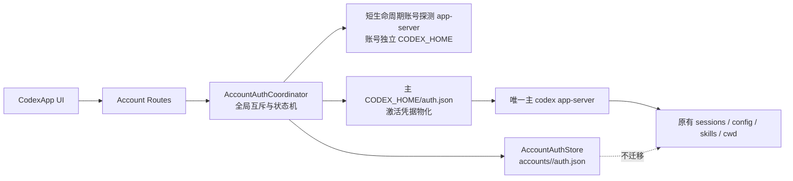

# CodexApp 多账号额度切换开发方案

## 文档信息

| 项目 | 内容 |
| --- | --- |
| 项目/服务 | CodexApp |
| 文档目的 | 研究第三方 Codex 账号切换方案，并设计不迁移本地工作区的多账号切换、隔离测试实例及 tunnel 清理方案 |
| 适用环境 | `/home/Code/codexapp`，CodexApp `0.1.87`，Codex CLI/app-server `0.147.0` |
| 创建日期 | 2026-09-04 |
| 最后更新 | 2026-09-05 |
| 当前状态 | P0-P5 及 P6 非真实账号验证已完成；真实双账号登录与 A → B → A 验收待用户手工执行 |
| 维护者 | CodexApp 维护者 |

## 结论先行

建议采用：**单一主 app-server + 多个独立账号凭据配置档 + 共享且不迁移的主 `CODEX_HOME` 工作区**。

这意味着：

- CodexApp 仍只有一个负责真实对话的主 `codex app-server`。
- 每个账号只保存自己的认证材料，并用短生命周期、账号隔离的 app-server 做登录、刷新和额度探测。
- 切换时只替换主 `CODEX_HOME/auth.json` 的“激活副本”，随后安全重启主 app-server。
- `sessions/`、`archived_sessions/`、`history.jsonl`、`config.toml`、skills、memories、项目列表、当前路由、线程 ID 和线程 `cwd` 均留在原处，不复制、不软链接、不迁移。
- 第一版只做**人工、全局、空闲边界切换**；不做自动用尽切换、不做每个线程单独选账号、不同时运行多个真实对话 worker。
- 开发和真实双账号验收只在新实例进行；新实例严格监听 `0.0.0.0:59001`，不停止、不覆盖当前 `0.0.0.0:5900` 实例。
- 新实例默认无密码且不自动打开网页；CodexApp 启动过程不检查、启动或代办 `codex login`，登录只能由用户在账号 UI 中明确发起。
- 删除 CodexApp 内置 cloudflared/tunnel 能力，而不是把它改成默认关闭。

“只影响额度从哪里走”需要精确定义：本地状态层面可以做到只替换认证材料；但 ChatGPT 套餐额度与 OAuth 登录身份绑定，OpenAI 没有公开独立的“billing account selector”。因此切换后，后续远端请求不仅使用目标账号额度，也必然使用目标账号的远端权限、组织/工作区和账号级能力。本方案保证的是**不改变 CodexApp 本地工作区和会话载体**，而不是把额度与远端身份从协议上拆开。

## 目标与范围

### 目标

- 已登录的多个 ChatGPT/Codex 账号可以反复切换，正常的刷新令牌轮换不会让旧账号快照失效。
- 新增账号时不注销、不吊销当前激活账号。
- 切换只影响切换完成之后发起的新请求；已经在执行的请求不切换、不重放。
- 当前项目、文件系统工作目录、会话列表、选中的对话、历史消息和本机配置保持不变。
- 对失效、被吊销、欠费、网络异常等状态给出可执行且不误导的 UI 状态。
- 切换失败时恢复原账号，并恢复原线程的可读/可继续状态。
- 使用独立的开发测试实例完成实现、浏览器验证和真实账号验收；当前 `codexapp.service` 在整个开发阶段保持运行。
- 新实例可以访问与当前实例相同的项目目录和 `cwd`，但认证、账号池、进程、端口及其他可写运行态默认隔离。
- CodexApp 服务器启动不触发 Codex 登录；未登录状态由 UI 展示并等待用户主动操作。
- 完整删除内置 cloudflared 安装、探测、启动、QR、参数、依赖和专属文档/测试。

### 范围

- 包含：ChatGPT OAuth 账号的添加、重新登录、认证刷新、额度探测、手动切换、状态展示、失败回滚。
- 包含：现有 `accounts.json` 和 `accounts/<storageId>/auth.json` 的兼容迁移。
- 包含：新增 `0.0.0.0:59001` 隔离测试实例、严格端口行为及部署验收。
- 包含：删除 CLI 内置 tunnel 功能，并同步清理 README、项目规范、依赖、脚本和测试。
- 不包含：API Key 账单账户路由、自动额度耗尽切换、多账号并发执行、按线程固定不同账号、跨账号迁移 OpenAI 云端任务。
- 不包含：移动、复制或软链接 Codex 主工作区中的任何会话或项目数据。
- 不包含：卸载主机上可能被其他服务使用的 `cloudflared` 可执行文件，或删除与内置 tunnel 无关的 Cloudflare 插件/上游 WAF 提示。

## 官方认证行为与当前故障根因

### 官方边界

[OpenAI Codex Authentication](https://developers.openai.com/codex/auth/) 说明：CLI 与 IDE 扩展共享缓存登录；凭据通常保存在 `CODEX_HOME/auth.json` 或系统 keyring；ChatGPT 登录令牌会自动刷新。官方文档没有提供同时激活多个 ChatGPT 账号或单独选择额度来源的协议。

更关键的是，本机安装的 `codex-cli 0.147.0` 对应源码提交 `3ed6f04f6bf8b7c46299d1cb1ff99c74ce21a51d`：

- [`login.rs` 的 ChatGPT 登录流程](https://github.com/openai/codex/blob/3ed6f04f6bf8b7c46299d1cb1ff99c74ce21a51d/codex-rs/cli/src/login.rs#L118-L163) 会在启动新登录前调用 `clear_existing_auth_before_login()`。
- 该函数会执行 `logout_with_revoke()`；[`revoke.rs`](https://github.com/openai/codex/blob/3ed6f04f6bf8b7c46299d1cb1ff99c74ce21a51d/codex-rs/login/src/auth/revoke.rs#L1-L76) 优先吊销 refresh token，没有 refresh token 时才使用 access token。
- [`storage.rs`](https://github.com/openai/codex/blob/3ed6f04f6bf8b7c46299d1cb1ff99c74ce21a51d/codex-rs/login/src/auth/storage.rs#L150-L223) 显示文件型认证以 `CODEX_HOME/auth.json` 为边界保存。

因此，在同一个主 `CODEX_HOME` 中依次执行两次 `codex login`，不是“覆盖本地文件这么简单”：第二次登录会先尝试吊销第一个账号当前令牌。事先复制出来的第一个 `auth.json` 虽然文件完整，服务端令牌仍可能已经变成 `token_revoked`。这与本机观察到的“新账号可用，切回旧账号提示登录过期”完全一致。

### CodexApp `0.1.87` 的现有缺口

| 位置 | 当前行为 | 影响 |
| --- | --- | --- |
| `src/server/accountRoutes.ts:1025-1033` | 直接用主进程环境执行 `codex login` | 新登录与当前账号使用同一个 `CODEX_HOME`，会注销/吊销当前账号 |
| `src/server/accountRoutes.ts:645-785` | 把账号快照复制到临时 home，启动额度探测 app-server，结束后删除临时目录 | 即使刷新出新 token，也没有稳定的账号配置档可落盘 |
| `src/server/accountRoutes.ts:672-701` | 临时 JSON-RPC 客户端只处理自己发出的响应，忽略 app-server 主动请求 | 无法正确处理 `account/chatgptAuthTokens/refresh` |
| `src/server/codexAppServerBridge.ts:4616-4684` | 刷新逻辑固定读写主 `auth.json` | 激活账号快照不会随 refresh-token rotation 同步，后续切回可能使用旧 token |
| `src/server/accountRoutes.ts:1313-1403` | 切换前覆盖主 `auth.json`，重启 app-server 后再验证；失败时回写旧内容 | 已有基本回滚，但写入不是完整事务，且目标预检发生得太晚 |
| `src/server/accountRoutes.ts:1315-1321` | 后端只阻止 pending server requests | 没有覆盖其他线程、队列发送、正在执行/中断的 turn |
| `src/App.vue:1803-1809` | 前端只根据当前选中线程和本地发送状态阻止切换 | 多浏览器、后台队列或非选中线程仍可能被切换打断 |
| `src/App.vue:2622-2649` | 切换后保持路由并整体刷新 | 已具备工作区连续性的 UI 基础，但缺少后端线程恢复验收 |
| `src/cli/index.ts:528-530,639-640` | 启动参数仍建模 `--login/--no-login`，启动时检查认证并输出登录引导 | 登录职责仍混在服务器启动阶段；应改成只由账号 UI/API 显式发起 |
| `src/cli/index.ts:31-201,306-409,542-605,635-673` | 包含 cloudflared 下载、安装提示、tunnel 子进程、URL/QR 和 Tailscale 自动启用 | 与“取消 tunnel 功能”冲突，并增加启动副作用和依赖面 |
| `src/cli/index.ts:412-435` | 端口冲突时自动尝试下一个端口 | 测试实例可能悄悄从 `59001` 跳到其他端口，无法满足固定监听验收 |
| `vite.config.ts:114`、README、脚本和手工测试 | 仍保留 `.trycloudflare.com`、`--tunnel/--no-tunnel` 与 cloudflared 说明 | 功能删除后会留下无效配置和误导性操作步骤 |

## 同类工具研究

研究时间为 2026-09-04。下表使用固定提交作为行为依据；项目热度只用于理解成熟度，不作为架构正确性的证据。

| 工具 | 核心思路 | 可借鉴点 | 不直接采用的原因 |
| --- | --- | --- | --- |
| [Lampese/codex-switcher](https://github.com/Lampese/codex-switcher/tree/3323f3d5f4b496997e9db135d9ae63011737a226) | 保存多个 `auth.json`，切换前把当前 live auth 同步回账号库，再刷新目标 token 并覆盖主 auth | [`account.rs`](https://github.com/Lampese/codex-switcher/blob/3323f3d5f4b496997e9db135d9ae63011737a226/src-tauri/src/commands/account.rs) 中的串行切换、先同步再切换；[`token_refresh.rs`](https://github.com/Lampese/codex-switcher/blob/3323f3d5f4b496997e9db135d9ae63011737a226/src-tauri/src/auth/token_refresh.rs) 中先持久化轮换后的 refresh token；切换前要求 Codex 停止 | 本质仍是凭据物化；仓库未检测到许可证，不能复制其代码；它面向桌面切换器，不负责 CodexApp 内部队列和线程一致性 |
| [Sls0n/codex-account-switcher](https://github.com/Sls0n/codex-account-switcher/tree/fad1a4199d448ed9dee7661eab3769aabb15235f) | Unix 把主 `auth.json` 软链接到账号快照，Windows 复制文件 | 实现极小；Unix 下普通覆写可直接更新账号快照 | logout 会删除目标/链接，且依赖上游文件操作语义；缺少刷新互斥、健康检查和回滚，不适合作为服务端核心机制 |
| [dejavukong/codex-multi-account](https://github.com/dejavukong/codex-multi-account/tree/18694a0e9c9ecb8b62e2d14e4f88e4e17c416faf) | 每个账号一个完整 `CODEX_HOME`，启动 CLI/VS Code 时注入环境变量；可共享 `config.toml` | 认证隔离清晰，可并行运行多个账号 | 会把 sessions/history/logs 分开，直接违背“工作区不变”的主要目标 |
| [codex-multi-account-shared-history](https://github.com/MrKGhasemi/codex-multi-account-shared-history/tree/1b8c43c1fded369aa8836d8693dbea54bf123dc7) | 每账号独立 home，再把 `sessions/`、`archived_sessions/`、`history.jsonl` 链接到共享目录 | 说明“认证隔离 + 历史共享”在文件层可实现 | 会重接工作区文件结构，存在并发写同一会话风险，需要迁移与复杂回滚；对 CodexApp 过于侵入 |
| [lordydord/Codex-Account-Switcher](https://github.com/lordydord/Codex-Account-Switcher/tree/b223b24b05398f51a5194d253df2ba3aff05af81) | 包装外部切换命令，切换后验证目标账号，失败回滚，并重启桌面应用 | “停止/切换/验证/回滚/重启”的事务顺序；额度冷却与可用性状态 | 凭据生命周期委托给外部工具；自动续接和自动切换不适合第一版 |
| [irisxc4/codex-multi-account-router](https://github.com/irisxc4/codex-multi-account-router/tree/93e7a01c47ee973f6604001d2171557e36816b25) | 每账号一个 app-server worker，前置 RPC multiplexer；线程首次路由后粘在账号上 | [线程粘性与显式迁移 ADR](https://github.com/irisxc4/codex-multi-account-router/blob/93e7a01c47ee973f6604001d2171557e36816b25/docs/adr/0002-thread-sticky-and-explicit-migration.md)、[前端账号投影 ADR](https://github.com/irisxc4/codex-multi-account-router/blob/93e7a01c47ee973f6604001d2171557e36816b25/docs/adr/0004-front-account-projection.md) 对未来按线程路由有参考价值 | 多 worker、RPC 路由、线程所有权数据库和故障转移远超当前需求；会把“全局额度切换”升级为新的运行平台 |

### 归纳出的五类实现思路

1. **直接复制凭据**：最普遍、最接近当前 CodexApp，但必须补齐令牌轮换、互斥、验证和回滚。
2. **用软链接让 active auth 指向账号快照**：简单，但会把正确性绑定到上游对文件的 truncate/remove/rename 行为。
3. **每账号完整隔离 `CODEX_HOME`**：认证最干净，却自然分裂会话和配置。
4. **隔离 home 后再链接共享历史**：能恢复共享视图，但对工作区做了本方案刻意避免的物理改造。
5. **多个 app-server + 路由器**：适合并行多账号与自动路由，不适合“轻量、全局切换额度来源”的第一版。

## 推荐架构



### 0. 开发测试实例隔离

本次开发不得直接部署到当前生产实例。已核对的现状是：

| 项目 | 当前实例 | 新开发测试实例 |
| --- | --- | --- |
| 监听地址 | `0.0.0.0:5900` | **固定** `0.0.0.0:59001` |
| 服务/容器 | `codexapp.service` | 新建 `codexapp-multi-account-dev` 容器，不复用生产 unit |
| 应用目录 | `/home/docker/codexapp` | 使用当前源码构建的独立镜像/打包产物 |
| `CODEX_HOME` | `/root/.codex` | 独立 named volume 或 `/home/docker/codexapp-multi-account-dev/codex-home` |
| HTTP 密码 | 当前为无密码 | 固定无密码 |
| 启动后打开网页 | 当前关闭 | 固定关闭，浏览器由测试者手动打开 |
| 启动期 Codex 登录 | 当前通过 `--no-login` 抑制 | 新版根本不包含启动登录流程，不再需要该参数 |
| tunnel | 当前通过 `--no-tunnel` 抑制 | 新版不存在 tunnel 功能，不再需要该参数 |

实例要求：

- 先用 `lsof`/`ss` 确认 `59001` 空闲，再启动新实例。
- 新增严格端口模式；`59001` 被占用时启动必须失败，不得自动改用 `59002`。
- 按仓库 Provider/Auth Docker 工作流执行 `pnpm run build`、`pnpm pack`，镜像中安装打包后的 CodexApp 和指定版本的 `@openai/codex`。
- 容器发布端口为 `0.0.0.0:59001:59001`，应用进程使用 `--port 59001 --strict-port --no-password --no-open`。
- 命令中不再出现 `--no-tunnel` 或 `--no-login`：前者因为功能已删除，后者因为服务器启动不再承担登录职责。
- 新实例使用独立 `CODEX_HOME` 和账号池，不能挂载 `/root/.codex`，所以登录、刷新、切换和失败注入都不会改写当前实例的认证状态。
- “可以共用同一工作区”在此定义为：两个实例可访问同一批真实项目目录，并保持相同绝对路径和 `cwd`。容器只按实际需要把已确认的项目根目录（例如 `/home/Code`）挂载到相同容器路径，不复制项目内容。
- 不把生产 `sessions/`、`history.jsonl`、`auth.json` 或 `accounts/` 挂入测试实例。它们是可写运行状态，不属于项目工作区；同时共享会造成两个 app-server 争写和额度来源不一致。
- 如需验证历史线程连续性，在测试实例自己的 `CODEX_HOME` 创建测试线程并执行 A → B → A；不拿生产线程做开发期故障注入。

实现完成后的目标启动形态为：

```bash
# 容器内命令；实际镜像名和 volume 名在实施时确定
codexapp --port 59001 --strict-port --no-password --no-open
```

CodexApp 启动只完成 HTTP 服务、静态资源和 app-server 桥接初始化。未登录时正常打开 UI，由账号面板提示“添加账号”；启动过程不执行 `codex login`、不打开认证网页、不修改任何 auth 文件。

### 1. 数据边界

主 `CODEX_HOME` 继续承担所有真实工作区状态：

```text
CODEX_HOME/
├── auth.json                    # 当前账号的激活物化副本
├── accounts.json                # 非敏感账号元数据、状态、revision
├── accounts/
│   └── <storageId>/
│       └── auth.json            # 该账号的权威凭据配置档
├── sessions/                    # 保持原位
├── archived_sessions/           # 保持原位
├── history.jsonl                # 保持原位
├── config.toml                  # 保持原位
├── skills/                      # 保持原位
└── memories/                    # 保持原位
```

约束：

- `accounts/<storageId>/auth.json` 是账号凭据的权威副本；主 `auth.json` 只是当前激活版本的物化。
- 不采用主 `auth.json` 到账号文件的软链接，避免 `codex logout/login` 删除链接目标或上游改用 rename 后语义改变。
- 账号目录 `0700`、认证文件 `0600`；API、日志、遥测和错误对象不得包含 token、授权码或完整 auth JSON。
- `storageId` 继续使用稳定的账户身份组合，不能只用 email；团队 workspace 下同一用户可能有多个 account/workspace identity。
- `accounts.json` 增加 schema version、`credentialRevision`、`authStatus`、`lastVerifiedAtIso` 等元数据，不存 token。

### 2. 账号登录必须隔离

登录是账号面板中的显式业务操作，不是 CodexApp 启动步骤。新增/重新登录流程不得在主 `CODEX_HOME` 中执行 `codex login`：

1. UI 顶部入口显示为“添加账号”；账号卡片对失效或已有账号提供“重新登录”。
2. 在 `accounts/.pending/<loginSessionId>/` 建立仅本次登录使用的隔离 home。
3. 对子进程设置 `CODEX_HOME` 为该目录，并确保该受管进程使用 file credential store；具体 CLI override 在 P0 用当前安装版本验证。
4. 完成浏览器回调后，从隔离 home 读取并解析 `auth.json`，通过 `account/read` 核验实际身份，并用稳定 identity 计算 `storageId`。
5. 如果账号池中不存在该 identity，将其作为新账号加入可切换账号池，状态设为 `ready`，但不自动激活、不影响当前额度来源。
6. 如果账号池中已经存在该 identity，则更新原条目的认证材料、套餐元数据、额度和 `lastVerifiedAtIso`，状态从 `reauth_required`/`stale` 等恢复为 `ready`；不得新增重复账号卡片。
7. 如果操作从某张账号卡片的“重新登录”发起，登录结果必须与该卡片 identity 一致；用户在浏览器中登录了其他账号时返回 `account_identity_mismatch`，保留原条目和原凭据。
8. 重新登录的是非激活账号时，只更新其账号档；重新登录的是当前激活账号时，在全局空闲边界将新凭据物化到主 auth 并重启/复核主 app-server，但 `activeStorageId` 不变。
9. 原子写入对应账号配置档；失败时保留旧配置档，不触碰其他账号或主 auth。
10. 清理 pending home。取消登录只清理该 login session，不执行主账号 logout。

这样即使官方 `codex login` 仍执行“先 logout/revoke”，被清除的也只是隔离 home 中的凭据，不会吊销当前激活账号。

登录完成响应必须明确区分：

- `outcome: "added"`：新身份已加入账号池，当前激活账号不变。
- `outcome: "reauthenticated"`：已有身份的凭据和状态已刷新，账号数量不变。
- `outcome: "identity_mismatch"`：定向重新登录时登录了另一身份，未写入。

### 3. 账号级额度探测与刷新

用**持久凭据配置档 + 短生命周期 probe 进程**替代“复制到临时目录后无条件删除”：

- probe 的 `CODEX_HOME` 指向账号目录，或指向只把 auth 持久化回该目录的受控 profile；它不承载用户对话。
- 抽取可复用的 JSON-RPC 客户端，既处理响应，也处理 app-server 主动发来的 `account/chatgptAuthTokens/refresh`。
- 刷新方法接收明确的账号/store 参数，不再固定读写主 `auth.json`。
- 每个账号使用 single-flight refresh；全部账号的登录、刷新、切换、删除再由一个全局 coordinator 串行化关键写操作。
- OAuth 返回新 refresh token 时，先把新凭据写入该账号的权威配置档，再回复 app-server；不能在错误分支中丢弃已经轮换的 token。
- 额度刷新使用 TTL，后台探测并发限制为 1（后续有测量证据再调整），避免账号数增长带来无界进程和网络扇出。

### 4. 主账号自动刷新同步

主 app-server 收到 `account/chatgptAuthTokens/refresh` 时：

1. coordinator 锁定当前 `activeStorageId` 和 credential revision。
2. 从该账号权威配置档发起刷新，校验返回的 account identity 未改变。
3. 先提交账号配置档的新 revision，再更新主 `auth.json` 的激活物化。
4. 两处都成功后才向 app-server 返回新 token。
5. 如果账号档已保存、主物化失败，不回滚到已失效的旧 refresh token；标记 `active_materialization_dirty`，阻止新 turn，并在下一次启动前从权威档重新物化。
6. 旧异步操作携带的 revision/operation epoch 不匹配时不得覆盖新凭据。

### 5. 切换是一个事务

账号切换是**服务器全局行为**，不是某个浏览器标签页的局部设置。建议请求包含 `storageId`、`expectedActiveStorageId` 和可选 `resumeThreadId`；不满足乐观并发前提时返回 `409`。

```text
获取 coordinator 锁
  -> 后端确认全局空闲
  -> 同步当前主 auth 到当前账号档（身份匹配且 revision 合法时）
  -> 在目标账号 profile 中刷新/验证 account/read + rateLimits/read
  -> 保存可能轮换的新 token
  -> 原子物化目标 auth 到主 CODEX_HOME
  -> 停止并重新启动主 app-server
  -> 核对 account/read 确为目标账号
  -> 对当前选中线程执行 thread/read / 必要时 thread/resume
  -> 提交 activeStorageId
  -> 释放锁并刷新 UI
```

后端“全局空闲”至少包含：

- 所有线程都没有 active turn，而不只是当前 UI 选中的线程。
- 没有待发送/重试的队列项，没有正在执行的 interrupt/steer。
- 没有待人工处理的 approval、request_user_input 或其他 server request。
- 没有正在进行的登录、刷新、删除或另一切换事务。

失败回滚：

- 目标账号预检失败时不修改主 auth。
- 已物化后验证失败，则原子恢复前一账号权威配置档到主 auth，重启主 app-server，并重新读取/恢复同一个线程。
- 不重发上一条用户消息，不把未完成 turn 迁到另一账号。
- 只有“原账号恢复 + 原线程可读”成功才把响应定义为已回滚；否则返回明确的 degraded 状态并阻止发送，而不是伪装成功。

### 6. 会话与工作区连续性

切换前后始终由同一个主 `CODEX_HOME` 承载会话。主 app-server 重启会丢失内存缓存，但不会移动 rollout 文件。现有 bridge 已有 `thread/resume` 恢复路径，可作为基础，但切换事务需要显式验收：

- UI 路由、selected thread ID、项目 root 和 `cwd` 不变。
- `thread/read` 的消息数、最近一条消息标识和 rollout path 不变。
- 恢复完成前禁用 composer；恢复成功后才显示切换成功。
- 若目标账号下无法恢复当前线程，则回滚账号，不能为了完成切换而创建新线程或复制历史。

这保证的是本地工作区连续性。OpenAI 云端异步任务、团队 workspace、连接器或其他账号级远端资源可能属于原账号；第一版不尝试跨账号迁移这些对象。

### 7. 状态机与 UI

建议状态：

| 状态 | 含义 | UI 行为 |
| --- | --- | --- |
| `ready` | token 和额度探测可用 | 可切换 |
| `refreshing` | 正在刷新 token/额度 | 显示进行中，临时禁用重复操作 |
| `switching` | 全局切换事务进行中 | 全局禁用发送和账号操作 |
| `reauth_required` | refresh token 被吊销、无效或账号身份不一致 | 不再盲目切换，显示“重新登录” |
| `payment_required` | 账号额度/套餐不可用 | 显示原因；默认禁用切换 |
| `stale` | 最近探测过期，但没有确认账号失效 | 允许手动重试探测，不误判为退出登录 |
| `transient_error` | 网络、超时或上游暂时故障 | 保留上次可信额度，允许重试 |
| `materialization_dirty` | 权威账号档已更新，但主 auth 同步失败 | 禁止新 turn，自动修复或提示恢复 |

错误分类不得只看 HTTP 状态：`401 token_revoked` 应直接进入 `reauth_required`；普通 access token 过期应先尝试 refresh；网络超时不能把账号永久标成失效。

账号面板交互调整：

- 面板顶部当前笼统的“登录”改为“添加账号”，说明文字改为“登录后加入可切换账号池，不会自动切换”。
- 删除“也可以运行 `codex login` 后点刷新”之类的引导；外部主 home 登录绕过账号 coordinator，会重新引入吊销和快照不同步问题。
- 每张已有账号卡片提供“重新登录”。`reauth_required` 状态突出该动作；`ready` 账号也允许用户主动刷新认证。
- “重新登录”弹窗显示目标账号，完成后如果身份不匹配，保留弹窗错误，不把另一账号悄悄加入池中。
- 顶部“添加账号”最终登录到已有身份时，UI 根据后端 `reauthenticated` 结果原位更新对应卡片，并提示“登录状态已刷新”，不增加账号数量。
- 登录到全新身份时，UI 根据 `added` 结果新增卡片，提示“已加入账号池；当前仍使用原账号额度”，不改变 active 高亮。
- “重新登录”“刷新额度”“切换账号”是三个不同动作和 loading 状态，文案与禁用条件不得复用成一个模糊的“刷新”。
- CodexApp 未登录启动时仍进入主界面，账号区域显示空状态与“添加账号”按钮，不跳转、不弹浏览器、不在服务端自行启动登录。

切换成功提示建议明确写成：

> 已切换到“账号显示名”。之后新发起的请求将使用该账号额度；当前项目、工作目录和对话未改变。

第一版不提供“额度耗尽后自动切换”。自动切换会在用户不知情时改变远端账号身份，而且与进行中的 turn、审批和工具调用存在竞态；待手动切换稳定并有完整遥测后再单独设计。

### 8. 删除 cloudflared/tunnel 与启动登录职责

这部分按“删除功能”执行，不保留隐藏入口或自动探测：

- 从 `src/cli/index.ts` 删除 cloudflared 命令探测、下载安装、交互提示、prompt marker、架构映射、tunnel 子进程、URL 解析、QR 输出、shutdown 清理和 Tailscale 自动启用 tunnel 的逻辑。
- 删除 `--tunnel` 与 `--no-tunnel` CLI 参数。升级部署前先修改现有服务/脚本的启动命令，否则新版 Commander 会因旧参数启动失败。
- 删除只被 tunnel 使用的 `qrcode-terminal`、对应类型依赖和 lockfile 条目；删除不再使用的 Node import。
- 从 `vite.config.ts` 删除 `.trycloudflare.com` 专用 allowed host。
- 删除 README 中的 cloudflared 快速隧道、Tunnel URL/QR、`--no-tunnel` 示例和 tunnel 功能宣传；保留与内置 tunnel 无关的普通反向代理兼容说明时，应明确由用户自行部署外部代理。
- 删除 tunnel 专属手工测试；把同时覆盖 Tailscale trusted CIDR 或通用反向代理认证的测试拆开保留，只删除 cloudflared/tunnel 断言。
- 更新 `scripts/dev.cjs`、Docker 测试脚本、Whisper 脚本、各测试文档以及项目 `AGENTS.md` 中的命令，去掉已经不存在的 `--no-tunnel`。
- 升级时可以删除 CodexApp 自己留下的精确 marker `CODEX_HOME/.cloudflared-install-prompted`，但不得卸载 `~/.local/bin/cloudflared` 或系统 cloudflared；可执行文件可能由其他项目使用。
- `src/server/codexAppServerBridge.ts` 中“语音接口被 Cloudflare WAF 阻断”的诊断，以及 Cloudflare 插件测试，不属于 CodexApp 内置 cloudflared tunnel，不能因为字符串命中而误删。

服务器启动登录职责同步收敛：

- 删除 server start options 中的 `login` 字段、启动期 `hasCodexAuth()` 检查，以及 `--login/--no-login` 参数。
- 删除或改造会在主 `CODEX_HOME` 直接执行 `codex login` 的 `codexapp login` 子命令；第一版建议删除，避免绕过账号隔离流程。
- 启动时允许完全未登录；只有用户点击“添加账号”或“重新登录”时，账号 API 才创建隔离 login session。
- 更新所有脚本、服务和文档，移除已经不存在的 `--no-login`，并以“启动不处理登录”为默认契约。

## 代码改造范围

| 文件/模块 | 计划变更 |
| --- | --- |
| 新建 `src/server/accountAuthStore.ts` | 认证解析、身份提取、权限检查、账号档原子写入、revision 和激活物化 |
| 新建 `src/server/accountAuthCoordinator.ts` | 全局互斥、single-flight、状态机、登录/刷新/切换/回滚事务 |
| 新建 `src/server/accountAppServerProbe.ts` | 账号隔离的短生命周期 app-server 与完整双向 JSON-RPC 处理 |
| `src/server/accountRoutes.ts` | 收敛为 HTTP 参数校验和 coordinator 调用；登录改用 pending home；返回结构化状态 |
| `src/server/codexAppServerBridge.ts` | auth refresh 接入显式 account store；暴露后端全局空闲快照；支持切换后的线程恢复验证 |
| 队列/turn 状态相关服务 | 提供权威 `RuntimeQuiescenceSnapshot`，覆盖后台和非选中线程 |
| `src/api/codexGateway.ts` | 新请求/响应类型、乐观并发参数、re-auth 和结构化错误 |
| `src/types/codex.ts` | 账号状态、action required、credential revision 等公共类型 |
| `src/App.vue` | “添加不切换”、重新登录、状态徽标、全局切换锁和连续性提示 |
| `src/composables/useUiLanguage.ts` | 中英文提示和可恢复错误文案 |
| `src/style.css` | 账号状态在 light/dark theme 下的共享样式 |
| `src/cli/index.ts` | 删除 cloudflared/tunnel 和启动登录逻辑；增加 `--strict-port`；保留无密码和不打开网页参数 |
| `vite.config.ts` | 删除 `.trycloudflare.com` 专用 allowed host；开发实例接受显式 `0.0.0.0:59001` |
| `package.json`、`pnpm-lock.yaml` | 删除 `qrcode-terminal` 及其类型依赖；增加/调整隔离账号实例的测试脚本（如需要） |
| `scripts/dev.cjs`、Docker/测试脚本 | 删除 `--no-tunnel`、`--no-login`；测试账号功能统一使用 `59001` 新实例 |
| README、`PROJECT_SPEC.md`、`AGENTS.md` | 删除内置 tunnel 与启动登录说明，记录 `59001` 账号测试实例流程 |
| `tests/cli-network-platform/` | 删除 tunnel 专属用例，保留并重写独立的 Tailscale/反向代理认证用例，更新索引 |
| `tests/accounts-feedback-observability/` | 增加新增账号、重复身份 re-auth、identity mismatch、切换连续性测试说明 |

建议把目前 `accountRoutes.ts` 中的大段认证实现移出，但只按上述三个职责拆分，不引入通用任务编排框架或多 worker 路由层。

## API 草案

### `GET /codex-api/accounts`

每个账号只返回非敏感字段：

```json
{
  "storageId": "opaque-id",
  "email": "masked-or-display-value",
  "planType": "pro",
  "isActive": true,
  "authStatus": "ready",
  "quotaStatus": "ready",
  "canSwitch": true,
  "actionRequired": null,
  "lastVerifiedAtIso": "...",
  "credentialRevision": 12
}
```

### 登录

- `POST /codex-api/accounts/login/start`：创建隔离 login session，请求体为 `{ intent: "add" }` 或 `{ intent: "reauth", targetStorageId }`。
- `POST /codex-api/accounts/login/complete`：提交 `loginSessionId` 和 callback URL，完成隔离登录；返回 `added`、`reauthenticated` 或 identity mismatch，不自动切换额度来源。
- `POST /codex-api/accounts/login/cancel`：停止该 pending login，不注销主账号。

完成响应示例：

```json
{
  "outcome": "added",
  "account": { "storageId": "target-id", "authStatus": "ready" },
  "activeStorageId": "unchanged-active-id",
  "poolSize": 2
}
```

后端以登录完成后读取到的 account identity 为准，不能依赖前端声称的 email。`intent=add` 遇到已有 identity 时转为 `reauthenticated`；`intent=reauth` 遇到非目标 identity 时拒绝写入。

### 切换

`POST /codex-api/accounts/switch`：

```json
{
  "storageId": "target-id",
  "expectedActiveStorageId": "current-id",
  "resumeThreadId": "optional-selected-thread-id"
}
```

响应除目标账号外，返回 `workspaceContinuity`：是否核对 thread、thread ID、cwd 和恢复结果。不得返回 token、auth 路径的内容或 callback 中的敏感参数。

## 分阶段实施计划

### P0：建立隔离测试实例并冻结行为

- 固定并记录开发/部署时使用的 Codex CLI 版本与 upstream 对应提交。
- 构建当前基线，在独立容器和独立 `CODEX_HOME` 中启动 `0.0.0.0:59001`；确认 `5900` 生产实例 PID、unit、端口和文件均未变化。
- 新增/验证 strict port：`59001` 被占用时测试实例明确失败，不回退到其他端口。
- 验证测试实例无密码、不自动打开网页，启动期间不创建登录进程、不改 auth。
- 只挂载实际项目根目录到相同绝对路径，验证两个实例能访问同一项目文件；不共享认证或会话运行态。
- 冻结第一版语义：全局手动切换、仅空闲边界、新账号只加入池、已有账号原位 re-auth、工作区不迁移。

验收：`5900` 与 `59001` 同时存在且归属正确；测试实例启动/停止不改变生产 `auth.json`、`accounts.json`、sessions 或生产 app-server 进程。

### P1：删除 tunnel 与启动登录副作用

- 删除 cloudflared/tunnel 的 CLI、依赖、allowed host、文档、脚本和专属测试。
- 删除服务器启动的 login option/auth 检查，以及直接在主 home 登录的 CodexApp 子命令。
- 批量更新启动命令，移除 `--no-tunnel`、`--no-login`；生产 unit 的命令只记录为待发布变更，本阶段不重启生产。
- 保留 Tailscale trusted CIDR、普通反向代理和 Whisper WAF 诊断等无关能力。

验收：对源码、构建产物、依赖和用户文档执行 `rg`，不存在内置 cloudflared/tunnel 入口；启动无登录子进程；新版测试实例仍严格监听 `59001`。

### P2：认证存储与状态模型

- 实现 `AccountAuthStore`、schema migration、权限校验、原子写入和备份恢复。
- 加入 identity/revision 校验和细粒度错误分类。
- 验证当前 CLI 设置 file credential store 的可靠方式，以及 app-server 始终从受管 `CODEX_HOME/auth.json` 读取。
- 为官方 login-before-revoke 行为加入版本化兼容测试/fixture；上游改变时测试先失败。
- 迁移只增加元数据，不改动现有会话、配置和账号 auth 内容。

验收：损坏 JSON、缺失 token、storageId 冲突、旧 schema、并发旧 revision 均有确定结果。

### P3：隔离登录、去重 re-auth 与账号级刷新

- 登录迁移到 pending `CODEX_HOME`。
- 完成结果按 identity 选择 `added` 或 `reauthenticated`，定向重新登录执行 identity mismatch 防护。
- 新账号加入账号池但不激活；已有账号更新原条目而不是重复新增。
- 实现完整双向 JSON-RPC probe，正确响应 token refresh 请求。
- 活跃账号与非活跃账号都把旋转后的 refresh token 保存到各自权威配置档。

验收：添加 B 不修改/吊销 A；再次登录 B 只更新 B 且池大小不变；定向登录错账号不写入；A、B 多次探测和 token rotation 后仍能切回。

### P4：事务切换与线程恢复

- 接入后端全局空闲检查和 coordinator 锁。
- 实现目标预检、原子物化、主 app-server 重启、身份复核、线程恢复、失败回滚。
- 防止旧 refresh/switch promise 在新操作完成后反向覆盖。

验收：A → B → A 成功；任一步注入失败都恢复 A；没有 turn 被重发或跨账号继续执行。

### P5：UI 与可观测性

- 落地“添加账号”“重新登录”“刷新额度”“切换账号”四类清晰动作。
- 根据 `added`、`reauthenticated`、identity mismatch 展示不同结果，不自动切换新账号。
- 展示账号状态、全局切换中状态和工作区连续性结果。
- 将 401 revoked、402/payment required、网络超时分开展示。
- 日志只记录 storageId 的短标识、操作阶段、耗时、结果码和 revision，不记录凭据。

验收：light/dark theme、页面刷新后 active 状态、新增/重复登录、失败重试和多标签页冲突均符合预期。

### P6：`59001` 真实双账号验收

- 按 Provider/Auth Docker 工作流打包并重新部署新实例，不覆盖 `/home/docker/codexapp` 或 `codexapp.service`。
- 在测试实例的独立 `CODEX_HOME` 中登录两个账号，执行只读 `account/read`、`rateLimits/read` 和测试线程 A → B → A 恢复。
- 验证新账号只入池、已有账号 re-auth 不重复、切换只改变测试实例额度来源。
- 确认当前 `5900` 实例的 active account、进程、线程和 auth 文件均未变化。
- 不发送真实业务消息，不自动切换账号；通过后提交验收结果，再由用户决定是否另行安排生产升级。

## 测试与验收

### 单元测试

- strict port 在 `EADDRINUSE`/`EACCES` 时失败，不递增端口。
- CLI 参数中不存在 tunnel/login startup options；启动路径不会调用登录流程。
- auth identity 解析与 storageId 稳定性。
- 原子写、权限、revision、旧操作 epoch 拒绝。
- refresh token rotation：新 refresh token 必须先持久化。
- `token_revoked`、access expired、payment required、timeout 的分类。
- 失败回滚不能用旧 token 覆盖已经轮换的新 token。

### 集成测试

使用 fake OAuth server 和 fake/fixture app-server，不写真实凭据：

- 启动 `59001` 不产生 Codex 登录子进程、不创建/改写 auth；端口冲突时失败。
- 隔离登录过程中主 auth 始终不变。
- `intent=add` 登录新身份后 pool size +1、active ID 不变；登录已有身份后 pool size 不变、revision 增加。
- `intent=reauth` 登录错误身份时不更新目标，也不把错误身份加入池。
- A → B → A，包含 access token 过期和 refresh token rotation。
- refresh token 被吊销时目标保持未激活并进入 `reauth_required`。
- probe 主动发送 `account/chatgptAuthTokens/refresh` 时客户端正确响应并落盘。
- app-server 启动失败、身份不符、额度读取失败、线程恢复失败分别触发正确回滚。
- 切换期间拒绝 active turn、后台队列、approval 和并发第二次切换。
- 回滚后原 thread ID、cwd、rollout path、消息计数不变，且没有重复 `turn/start`。

### 构建与运行时验证

- 修改前后分别记录 `5900` listener、`codexapp.service` PID/启动命令和关键 auth 文件摘要；不输出文件内容。
- 运行现有相关单元测试，并新增：
  - `src/server/accountAuthStore.test.ts`
  - `src/server/accountAuthCoordinator.test.ts`
  - `src/server/accountAppServerProbe.test.ts`
  - 扩展 `src/server/codexAppServerBridge.authRefresh.test.ts`
- `pnpm run build`。
- `pnpm pack --pack-destination /tmp`，构建安装该 tarball 与固定 Codex CLI 的独立测试镜像。
- 服务端/runtime 模块改动后执行 CJS smoke test，验证打包后的公开入口能够被 `require(...)`。
- 启动新实例前确认 `59001` 空闲；启动后分别验证 `0.0.0.0:5900` 和 `0.0.0.0:59001` 的进程、cwd、镜像/构建来源和 `CODEX_HOME` 归属。
- 浏览器和性能验证统一以 `http://127.0.0.1:59001` 为目标；保存账号面板 light/dark 截图，并验证刷新后 active 状态仍正确。同步更新仓库中仍固定要求 `4173` 的相关开发说明，避免测试误连旧实例。
- 验证启动过程没有打开浏览器、没有密码页、没有 `codex login` 进程、没有 cloudflared 进程和 tunnel/QR 输出。
- 对仓库执行 cloudflared/tunnel 残留审计；允许的例外必须是已经说明的第三方 Cloudflare WAF 或插件文本，不能是内置 tunnel 功能。
- 功能实现时更新 `tests/accounts-feedback-observability/` 与 `tests/cli-network-platform/` 的相关手工测试文档及索引；本方案阶段不提前写“已验证”记录。

### 性能审计

关注指标：

- 切换总耗时及各阶段耗时：目标预检、auth 物化、app-server 初始化、thread resume。
- 单次切换启动的子进程数，必须有确定上限；后台额度刷新并发默认 1。
- 账号轮询请求数、重复 `account/read`/`rateLimits/read`、进程泄漏和 auth cache 失效。
- 以 `PROFILE_BASE_URL=http://127.0.0.1:59001` 运行 `pnpm run profile:browser` / `pnpm run profile:thread`，检查 `duplicateCounts`、`warnings`、`totalApiKB` 和慢请求。
- 账号数量增长时不得出现无界 worker 常驻或 O(accounts) 高频探测；使用 TTL + single-flight。

第一版性能目标建议作为验收基线，而不是提前做复杂优化：无泄漏进程、无重复 turn、无重复切换请求；本机正常网络下切换 P95 在实际测量后设定门槛。

### 最终验收条件

- [x] 当前实例继续监听 `0.0.0.0:5900`；测试实例严格监听 `0.0.0.0:59001`，没有端口自动递增。
- [x] 测试实例无密码且启动后不打开网页；CodexApp 启动未发起、代理或提示执行 Codex 登录。
- [x] 测试实例能访问与当前实例相同的项目目录和 `cwd`，但拥有独立 `CODEX_HOME`、账号池和 app-server 进程。
- [x] 源码、CLI help、依赖、构建产物、README 和有效测试中不再存在 CodexApp 内置 cloudflared/tunnel 功能。
- [ ] 点击“添加账号”登录新身份只把它加入可切换账号池，不改变当前激活账号。
- [ ] 通过“添加账号”再次登录已有身份时原位刷新状态，通过“重新登录”登录错误身份时不写入。
- [ ] 登录 B 的整个过程中，A 的权威凭据和主工作区未被修改或吊销。
- [ ] 正常 token rotation 后，A → B → A 无需重新登录。
- [ ] 切换后 `account/read` 和额度信息都来自目标账号。
- [ ] 切换前后 selected thread ID、cwd、rollout path、消息数和项目列表一致。
- [x] `sessions/`、`archived_sessions/`、`history.jsonl`、`config.toml`、skills、memories 没有被迁移、复制或重接链接。
- [x] 任何进行中 turn、队列项、approval 存在时后端拒绝切换（自动测试已覆盖；真实账号复核待 P6 手工步骤）。
- [x] 切换失败自动恢复原账号和原线程，且不重发消息（自动故障注入已覆盖；真实账号复核待 P6 手工步骤）。
- [ ] 被吊销账号显示“重新登录”，不会反复尝试无效切换。
- [x] 多浏览器并发切换通过 `expectedActiveStorageId` 和全局锁得到确定结果（自动测试已覆盖；浏览器双标签复核待 P6 手工步骤）。
- [x] API、日志、遥测、截图和文档均不包含 token 或完整 auth JSON。
- [ ] 完整开发和真实双账号验收只发生在 `59001`；`codexapp.service`、`/home/docker/codexapp` 和生产 `/root/.codex` 未被改动。

## 迁移与回滚

### 迁移原则

- 当前激活账号保持激活；升级本身不得自动切换。
- 保留现有账号条目和 auth 文件。已确认被吊销的账号标记 `reauth_required`，不自动删除。
- 首次启用前创建带时间戳的认证数据备份，范围仅限 `auth.json`、`accounts.json` 和 `accounts/`。
- 不对 sessions/history 做“迁移”，因为这正是本方案要避免的变更。
- 开发测试实例从空的独立 `CODEX_HOME` 开始，不复制生产认证；需要的测试账号通过新 UI 分别登录。
- 当前生产 unit 使用 `--no-tunnel --no-login`。未来生产升级前必须先准备去掉这两个参数的新 unit 内容，并把旧 unit 作为回滚备份；本次开发阶段不修改或重启它。
- 可清理 CodexApp 自己创建的 `.cloudflared-install-prompted`，但不删除 cloudflared 程序或其他项目的配置。

### 发布策略

- 在独立 feature branch 分阶段提交，每阶段一个可回退的离散提交。
- 所有构建先发布到 `codexapp-multi-account-dev`，对外仅使用 `59001`；生产 `5900` 不作为开发服务器或浏览器验收目标。
- 先用受控配置开关启用新版 coordinator；验证后再移除旧直接切换路径。
- 不并存两套会同时写 auth 的实现；旧路径在开关启用时必须完全失效。
- `59001` 验收通过不自动授权生产部署；切换 `/home/docker/codexapp` 和 `codexapp.service` 需要用户另行确认。

### 回滚条件

- 新实例未严格占用 `59001`、影响 `5900`，或读写了生产 `CODEX_HOME`。
- CLI/help/构建产物仍暴露 tunnel，或启动仍会处理 Codex 登录。
- 切换后账号身份与目标不符。
- 出现 refresh token 丢失、重复 turn、线程不可恢复或工作区路径变化。
- app-server 重启失败率或探测进程泄漏超过验收标准。

### 回滚步骤

1. 停止并移除 `codexapp-multi-account-dev` 测试容器，释放 `59001`；保留其 volume 供排障，除非用户明确要求删除。
2. 核对当前 `codexapp.service` 和 `5900` 仍正常；开发阶段不需要重启生产。
3. 如果回滚的是未来生产升级，先恢复旧 unit/启动命令和旧构建，再恢复升级前的 `auth.json`、`accounts.json` 和 `accounts/`。
4. 重新启动生产 CodexApp 主 app-server，核对原账号和原线程。
5. 检查 sessions/config 和项目工作区均未被变更。

### 回滚边界

- 仅恢复认证和账号元数据。
- 开发测试回滚默认只处理新容器、`59001` 和测试实例自己的 volume。
- 不覆盖用户项目文件、会话历史、Codex 配置、skills、memories 或仓库中的无关改动。

## 关键风险与应对

| 风险 | 影响 | 应对 |
| --- | --- | --- |
| OpenAI CLI 登录/存储语义变化 | 隔离假设失效 | 固定版本、P0 行为探针、升级 Codex CLI 时运行兼容测试 |
| refresh token rotation 后部分写失败 | 账号永久失效 | 权威账号档先提交；revision/dirty 状态；禁止旧 token 回滚覆盖 |
| 多标签页或后台队列竞态 | 请求记到错误账号或被中断 | 后端全局 quiescence + mutex + expected active ID |
| 账号切换改变远端权限 | 某些云端功能与原账号不同 | UI 明示全局账号身份变化；第一版不迁移云端任务 |
| 主 app-server 重启造成缓存丢失 | 当前对话短暂不可操作 | 恢复期间锁 composer；显式 thread read/resume 验收 |
| 两个实例共用可写 `CODEX_HOME` | auth、账号池、sessions 和 app-server 互相争写 | 只共享项目目录；测试实例使用独立 `CODEX_HOME` |
| 旧部署命令保留已删除参数 | 新版生产服务无法启动 | 发布前更新并验证 unit，保留旧构建和 unit 备份 |
| “添加账号”隐式切换额度 | 用户误以为仍在使用原账号 | 新身份只入池；后端返回 outcome 和不变的 active ID，UI 明示 |
| 软链接/完整 home 方案侵入工作区 | 历史分裂或并发写损坏 | 第一版明确禁止改造主工作区结构 |
| 第三方实现许可证不明确 | 代码合规风险 | 只借鉴公开架构思想，独立实现；尤其不复制 Lampese 代码 |

## 后续可选能力，不属于第一版

- 自动额度耗尽切换：只有在手动切换稳定、错误分类和遥测完善后再设计。
- 按新线程选择账号：应采用“线程创建时绑定、之后保持粘性”的语义。
- 多账号并发 worker：需要类似 RPC multiplexer 的独立架构、线程所有权表和故障恢复，不应塞进本次 coordinator。
- API Key 与 ChatGPT 套餐混合路由：计费和功能语义不同，应单独建模 provider/billing source。

## 审阅后建议的实施顺序

如果本方案获批，先实施 P0：建立并证明 `59001` 隔离测试实例；再实施 P1：删除 tunnel 和启动登录副作用。确认生产 `5900` 完全未受影响后，再进入 P2/P3 的认证存储与隔离登录。真实账号登录、切换和 UI 验收始终留到新实例，不触碰当前可用生产账号。

## 验证记录

| 检查项 | 方法 | 结果 | 时间 |
| --- | --- | --- | --- |
| 当前 CodexApp 版本 | 读取 `package.json` | `0.1.87` | 2026-09-04 |
| 当前 Codex CLI 版本 | 执行 `codex --version` | `codex-cli 0.147.0` | 2026-09-04 |
| 当前运行实例 | `systemctl show codexapp.service`、`lsof`、进程检查 | `/home/docker/codexapp` 使用 `/root/.codex`，监听 `0.0.0.0:5900` | 2026-09-04 |
| 新实例端口 | Docker、`curl`、端口冲突探针 | `codexapp-multi-account-dev` 严格监听 `0.0.0.0:59001`；第二实例以 `EADDRINUSE` 失败 | 2026-09-05 |
| tunnel/启动登录现状 | 审查 CLI、Vite、依赖、README、脚本和测试 | 已定位 cloudflared/tunnel 全链路及 `--login/--no-login` 启动职责 | 2026-09-04 |
| 当前账号实现 | 审查 `accountRoutes.ts`、`codexAppServerBridge.ts`、`App.vue` | 已定位登录隔离、刷新落盘、全局空闲和错误状态缺口 | 2026-09-04 |
| 官方登录行为 | 审查 OpenAI Codex 固定提交源码及官方认证文档 | 已确认同一 home 新登录前会 logout/revoke | 2026-09-04 |
| 第三方方案 | 审查六个仓库的 README、核心源码或 ADR | 已归纳五类架构及取舍 | 2026-09-04 |
| 功能实现 | 账号存储、隔离登录、探测、刷新、切换、回滚、连续性和 UI 代码审查 | P0-P5 已实现；全量 `20` 个测试文件、`178` 项通过，类型检查及构建通过 | 2026-09-05 |
| 打包实例 | `pnpm pack --pack-destination /tmp`、Docker 安装 tarball 与固定 CLI | `codexapp 0.1.87`、`codex-cli 0.147.0`；独立 volume，`/codex-home` 权限 `0700`，未自动创建认证状态 | 2026-09-05 |
| UI 验收 | Playwright 请求拦截构造无凭据双账号状态，检查 light/dark、四类动作、禁用状态及刷新持久显示 | 全部断言通过；截图保存于 `output/playwright/multi-account-light.png` 和 `multi-account-dark.png` | 2026-09-05 |
| 性能审计 | `PROFILE_BASE_URL=http://127.0.0.1:59001 pnpm run profile:browser` | 无 warnings；thread list、skills list、rate limits 各 1 次；总 API 响应约 `17 KB` | 2026-09-05 |
| 生产隔离复核 | systemd、监听器及生产状态文件元数据复核 | 生产 PID `2579161` 继续监听 `5900`；`auth.json`、`accounts.json`、`sessions/` 元数据与开发前一致 | 2026-09-05 |
| 真实双账号测试 | 用户在 `59001` 手工执行登录、token rotation 与 A → B → A | 按用户要求保留为最终手工 P6，尚未宣称通过 | 2026-09-05 |

## 变更记录

| 日期 | 变更内容 | 验证状态 |
| --- | --- | --- |
| 2026-09-04 | 初版：切换器研究、认证根因、账号隔离与事务切换方案 | 方案完成，功能未实施 |
| 2026-09-04 | 修订：固定 `59001` 隔离测试实例；删除 cloudflared/tunnel 和启动登录职责；明确新增账号与已有账号 re-auth 的 UI/API 语义 | 已完成源码/现网只读盘点，功能未实施 |
| 2026-09-05 | 实施 P0-P5，并完成 P6 的打包、隔离启动、strict-port、UI 与性能验证 | 自动验证完成；真实双账号登录与远端 A → B → A 待用户手工执行 |

## Codex 交接摘要

- 当前状态：P0-P5 已实现并通过自动测试；P6 独立打包实例已运行在 `59001`，真实双账号登录尚未执行。
- 已验证内容：tunnel/启动登录职责删除、strict-port、版本化存储、隔离 pending home、身份去重与错配保护、token rotation 落盘、A → B → A 事务路径、空闲边界、故障回滚、UI light/dark、刷新后 active 显示、打包运行和启动性能。
- 未验证内容：两个真实账号的远端 identity/额度、真实 refresh token rotation、真实测试线程 A → B → A，以及浏览器双标签下的最终人工复核。
- 下一步：用户按照 `tests/accounts-feedback-observability/multi-account-isolated-login-and-transactional-switching.md` 的“Final P6 manual actions”在 `http://192.168.50.46:59001/` 完成手工验收；通过前不升级生产。
- 关键路径：`src/cli/index.ts`、`src/server/accountRoutes.ts`、`src/server/codexAppServerBridge.ts`、`src/App.vue`、测试实例独立 `CODEX_HOME`。
- 操作限制：不得重启或覆盖当前 `codexapp.service`；不得让测试实例挂载生产 `/root/.codex`；不得在主 home 执行“添加账号”登录；不得改动工作区会话结构；不得记录或输出任何真实凭据；P6 通过也不自动授权生产升级。
